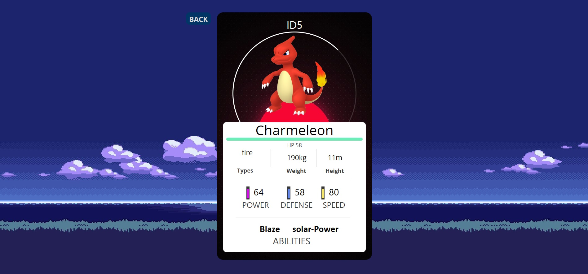

# Pokemon Project!

This is a project that I made to learn how to use the [Pokemon API](https://pokeapi.co/). with database in postgresql and sequelize, backend with express, and front with ReactJs, Redux and pure css.

I felt really consumed by the project and I learned a lot about the API and how to use it. i love the project and I am very happy to be a part of it. I hope you enjoy it.

Feel free to sort and filter the pokemons or create your own pokemon and see how it works.☻♥

Was realized for Henry bootcamp♥.

#### Technologies used:
-  React
-  Redux
-  Express
-  Sequelize - Postgres
-  NodeJs
-  Pure css

## Landing Page

  

## Home

  

## Filter

  

## Pokemon Detail

  

## React Form

  

